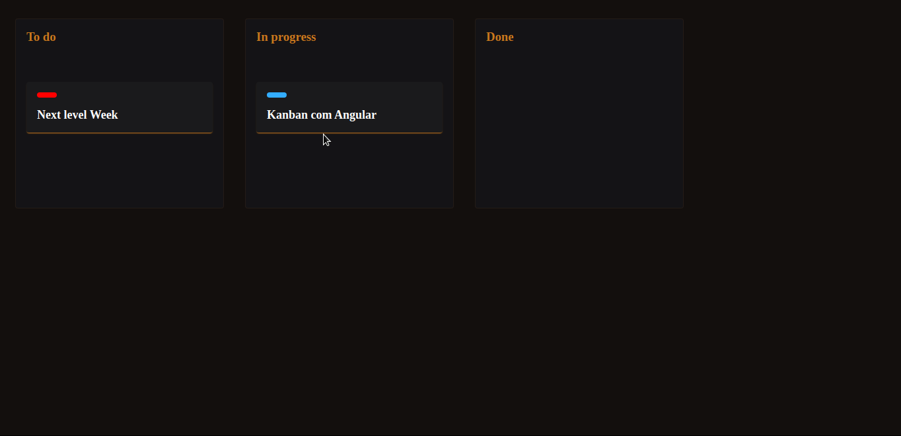

<h1 align="center">ToDo Drag and Drop</h1>

<p align="center">
  <a href="#rocket-sobre-o-projeto">Sobre o projeto</a> | <a href="#computer-tecnologias">Tecnologias</a> | <a href="#books-guia-de-instalação-e-execução">Guia de instalação e execução</a> | <a href="#scroll-licença">Licença</a>
</p>

## Preview


## :rocket: Sobre o projeto

<p>Este é um projeto de ToDo com Kanban afim de praticar manipulação da DOM com Angular, releitura da <a href="https://www.youtube.com/watch?v=6wn8hpUcEcM">Masterclass</a> da Rocketseat realizado onde foi desenvolvido com JS.</p>

## :computer: Tecnologias

- Angular

## :books: Guia de instalação e execução

### Pré-requisitos

- Yarn
- Git

### Como executar

```bash
# Clone este repositório e acesse a pasta
git clone https://github.com/nathaliacristina20/drag-and-drop-angular.git && cd drag-and-drop-angular

# Instale as dependências com yarn
yarn

# Rode a aplicação
yarn start

# Pronto, a aplicação está rodando! Acesse http://localhost:4200 no browser.
```

## :scroll: Licença

Esse projeto está sob a licença MIT. Veja o arquivo <a href="https://github.com/nathaliacristina20/drag-and-drop-angular/blob/master/LICENSE">LICENSE</a> para mais detalhes.

<hr />
<p>by Nathalia Cristina :wave: <a href="https://linktr.ee/nathaliacristina20">Get in touch!</a></p>
